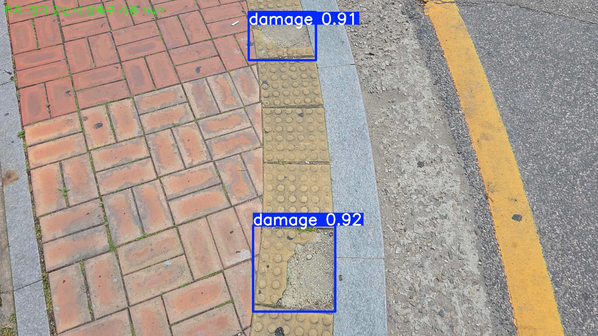
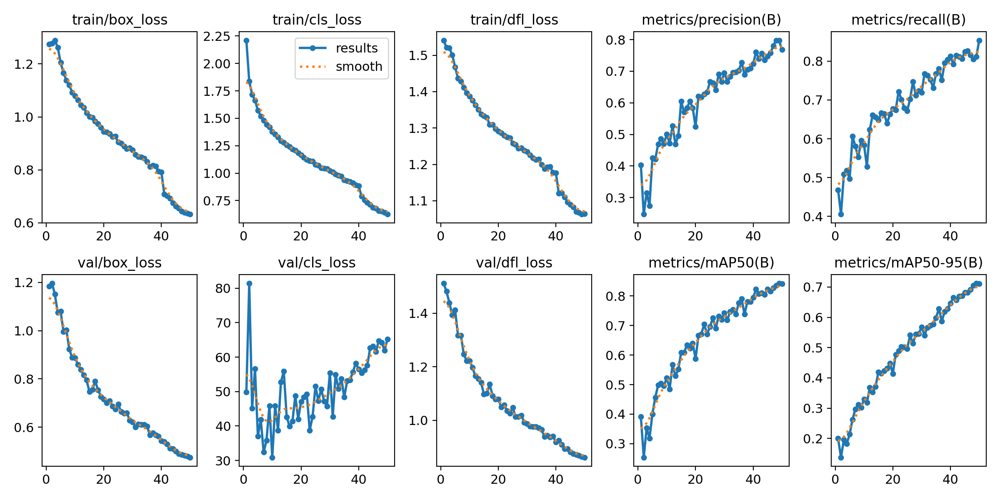
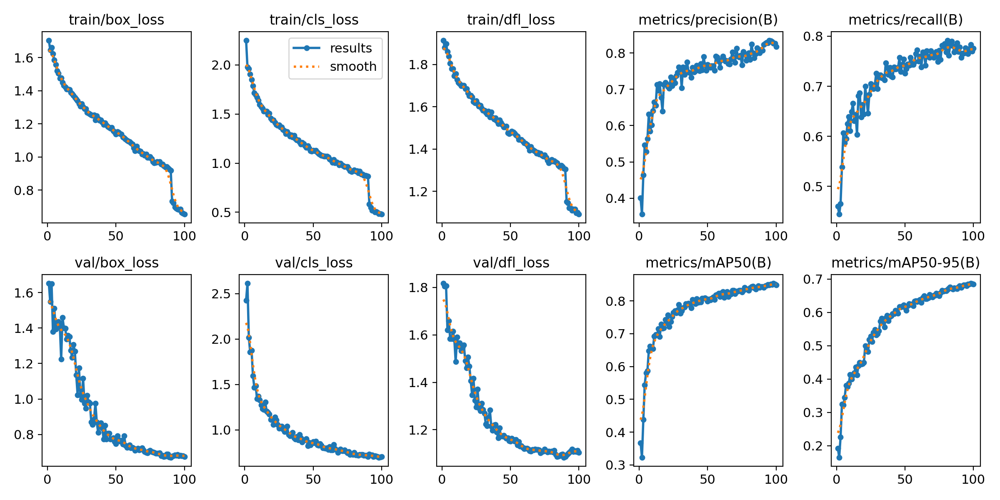
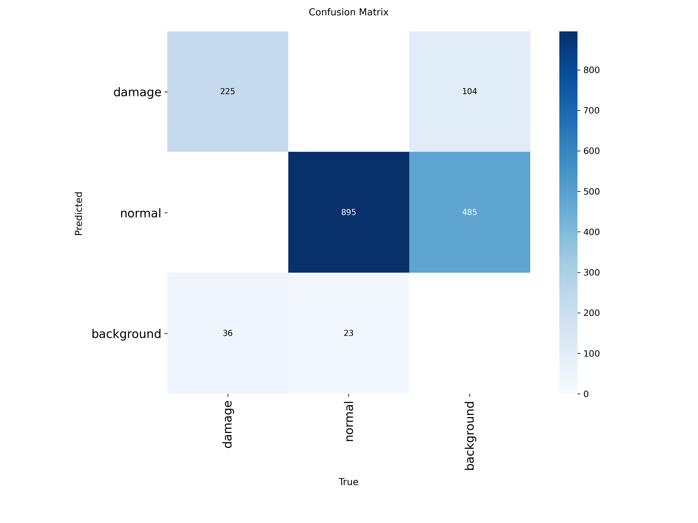
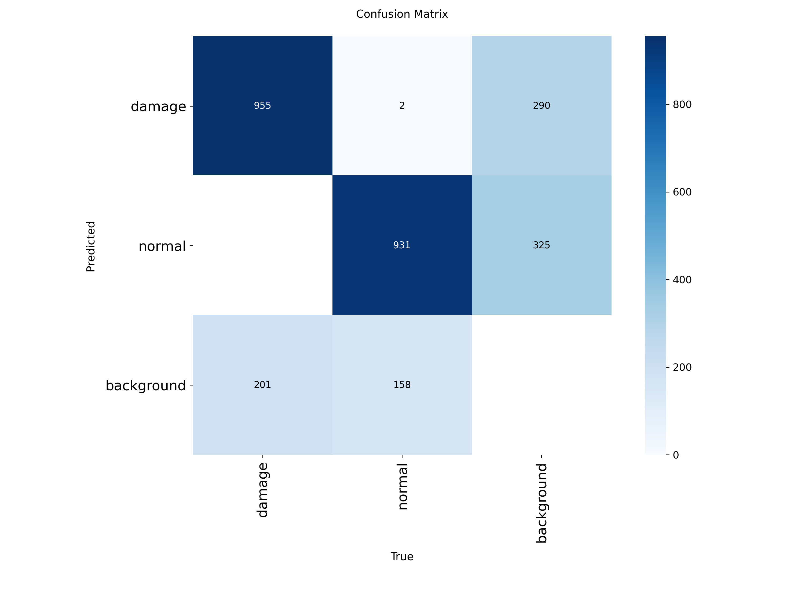

# 점자블록 파손 탐지 시스템
### Tactile Block Damage Detection System

> 스마트폰 카메라 + YOLOv8 + OpenCV를 활용한 실시간 점자블록 파손 자동 탐지 및 기록 시스템


---

## Overview

시각장애인의 보행 안전을 위한 점자블록은 파손되어도 체계적으로 관리되지 않는 문제가 있습니다.  
안산시 상록구 도로교통과 담당 공무원 인터뷰 결과, **민원이 접수되지 않은 구간의 파손 현황을 즉시 파악하기 어렵다**는 현장의 수요를 확인했습니다.

이 프로젝트는 순찰 중 스마트폰 카메라로 촬영된 영상에서 **파손 블록을 실시간으로 탐지하고**, 탐지 이미지와 위치·시각 정보를 자동으로 기록하는 시스템입니다.

---

## Demo

| 실시간 탐지 화면 | 자동 저장된 탐지 이미지 |
|:---:|:---:|
|  |  |

> 손상 블록 탐지 시 자동 캡처 + CSV 로그 기록 (3초 중복 방지)

---

## 주요 성능

| 지표 | Before (YOLOv8n) | After (YOLOv8s) | 변화 |
|------|:---:|:---:|:---:|
| mAP50 | 0.795 | **0.848** | +6.7% |
| mAP50-95 | 0.646 | **0.684** | +5.9% |
| Precision | 불안정 | **0.818** | 안정화 |
| Recall | 0.530 | **0.776** | +46.4% |
| val/cls_loss | 30~80 (폭발) | 0.68~1.0 | 정상화 |

### 학습 곡선 비교

| Before — YOLOv8n (라벨 수정 전, 50 epochs) | After — YOLOv8s (최종, 100 epochs, A100) |
|:---:|:---:|
|  |  |

### Confusion Matrix 비교

| Before | After |
|:---:|:---:|
|  |  |

---

## 실시간 탐지 파이프라인

```
📱 스마트폰 (IP Webcam)
    ↓  HTTP 스트리밍
🎞️ OpenCV 프레임 추출
    ↓
🤖 YOLOv8s 추론 (conf ≥ 0.5)
    ↓
🔍 damaged 클래스 필터링
    ↓  3초 경과?
⏱️ 중복 방지 인터벌 체크
    ↓
📸 자동 캡처 저장 (JPG)
📋 CSV 로그 기록 (시각·위치·신뢰도)
```

---

## 개선 과정

### 문제점 발견
- **라벨링 범위 오류**: 손상 부위(균열)에만 박스 → 블록 전체로 재라벨링
- **데이터 부족**: 약 2,000장 → 4,144장으로 확장
- **모델 한계**: YOLOv8n(3M params) → YOLOv8s(11M params)로 업그레이드

### 개선 사항
| 항목 | Before | After |
|------|--------|-------|
| 라벨링 기준 | 손상 부위 | 블록 전체 |
| 데이터 수 | ~2,000장 | 4,144장 |
| 모델 | YOLOv8n | YOLOv8s |
| Augmentation | 없음 | rotation / mixup / HSV |
| 학습 에폭 | 50 | 100 (patience=20) |

---

## Dataset

- **출처**: AI Hub — 노후 시설물 이미지 (점자블록 정상/교체폐기)
- **총 이미지**: 4,144장
- **클래스**: `normal` (정상) / `damaged` (교체폐기)
- **분할**: Train 3,049 / Valid 962 / Test 133
- **관리**: Roboflow v2 (Auto-Orient + Resize 640×640)

---

## 학습 환경 (Training)

| 파라미터 | 값 |
|---------|-----|
| model | YOLOv8s |
| epochs | 100 |
| patience | 20 |
| imgsz | 640 |
| batch | 16 |
| GPU | NVIDIA A100-SXM4-40GB (Google Colab Pro) |
| mixup | 0.2 |
| degrees | 15 |
| hsv_s / hsv_v | 0.7 / 0.4 |

---

## 설치 및 실행

### 1. 패키지 설치

```bash
pip install -r requirements.txt
```

### 2. 모델 다운로드

모델 가중치(`braille_best_s_v2.pt`)는 용량 문제로 Google Drive에서 다운로드하세요.

>(https://drive.google.com/file/d/1LgIzm6pSi8EZhob6CCzKOPwlEd3kgc0J/view?usp=sharing)

다운받은 `.pt` 파일을 프로젝트 루트에 위치시킵니다.

### 3. IP Webcam 앱 설정

1. 스마트폰에 **IP Webcam** 앱 설치
2. 앱 실행 후 하단 **"서버 시작"** 버튼 클릭
3. 화면에 표시되는 IP 주소 확인 (예: `192.168.0.10:8080`)

### 4. 실행

```python
# detect_and_capture.py 상단 설정값 수정
VIDEO_PATH = "http://[스마트폰IP]:8080/video"
LOCATION   = "탐지 구역 주소"
```

```bash
python detect_and_capture.py
```

- 탐지 화면: OpenCV 윈도우에 실시간 표시
- 캡처 저장: `captures/` 폴더
- 로그 저장: `detection_log.csv`
- 종료: `q` 키

---

## 파일 구조

```
📁 tactile-block-detection/
├── detect_and_capture.py          # 실시간 탐지 메인 스크립트
├── braille_train_yolov8s_final.ipynb  # 최종 학습 노트북 (Google Colab)
├── requirements.txt
├── assets/                        # README 이미지
│   ├── Results_before_modifying_ep50.png
│   ├── Results_yolov8s_ep100_A100.png
│   ├── Results_before_modifying_Confusion_Matrix.png
│   └── Results_yolov8s_ep100_A100_Confusion_matrix.png
├── reports/
│   ├── model_comparison_final.html    # Before/After 성능 비교 리포트
│   └── pipeline_infographic.html     # 파이프라인 시각화
└── sample_captures/               # 탐지 결과 샘플
```

---

## 한계점

| 한계 | 내용 | 해결 방향 |
|------|------|----------|
| 배경 오탐 | 맨홀, 그림자 등을 손상 블록으로 오인 | Negative sample 추가 |
| Domain Gap | 도보 촬영 데이터 vs 차량 운영 환경 | 차량 거치 데이터 추가 수집 |
| 야간·우천 미검증 | 다양한 조명·날씨 환경 데이터 부재 | 환경별 데이터 추가 수집 |

> 참고: Arya et al. (2024), *RDD2022*, Geoscience Data Journal — 차량 거치 스마트폰으로 47,420장 수집해 실시간 도로 손상 탐지 구현 사례

---

## 발전 계획

- **GPS 자동화**: 카카오 맵 / 네이버 지도 API 연동
- **운영 환경 재학습**: 차량 거치·야간·우천 데이터 추가
- **관리자 대시보드**: 파손 현황 지도 기반 웹 뷰어 구축

---

## Tech Stack

| 분류 | 기술 |
|------|------|
| 데이터 수집·라벨링 | Roboflow |
| 모델 학습 | YOLOv8s (Ultralytics), Google Colab Pro (A100) |
| 실시간 탐지 | OpenCV, IP Webcam |
| 언어 | Python 3.10 |

---

## Team

**하나됨** — 한신대학교 텐서프로그래밍 기말 프로젝트 (2026)

---

## Reference

- [Ultralytics YOLOv8 Docs](https://docs.ultralytics.com/)
- Arya, D. et al. (2024). RDD2022: A multi-national image dataset for automatic Road Damage Detection. *Geoscience Data Journal*, Wiley.
- AI Hub — 노후 시설물 이미지 데이터셋
